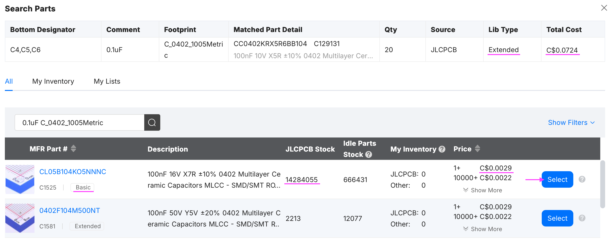
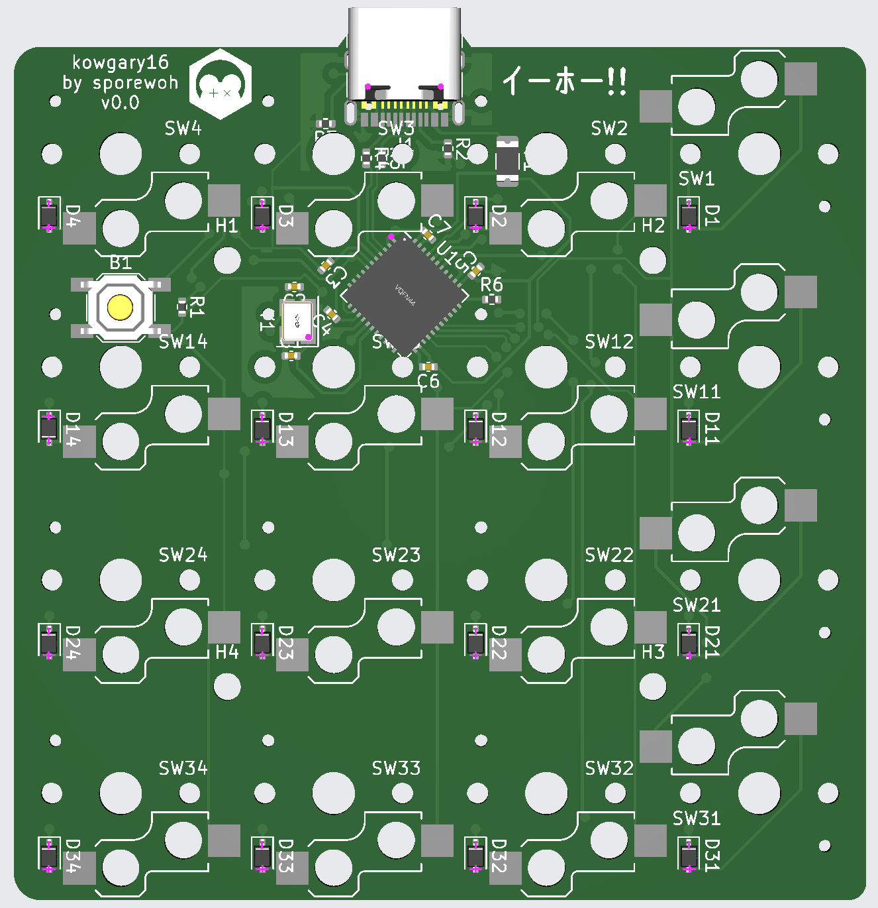
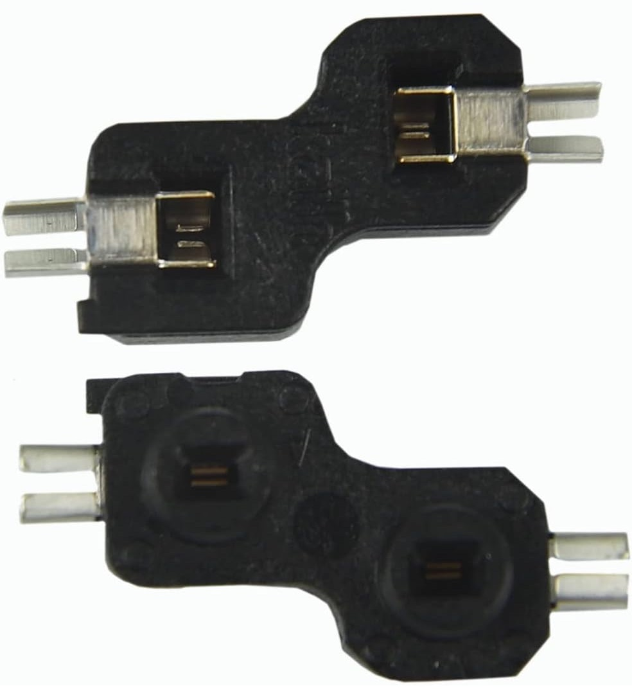

# kowgary16: Macropad Build Guide

This is a build guide for the [kowgary16](https://github.com/ChrisChrisLoLo/kowgary16) macropad.

### Disclaimer
_I did not design this macropad and i'm not associated with the author or Chosfox in any way. I documented the steps I followed in case it is of use to a future traveler. Some or even most of these steps are likely "obvious" to an experienced electronics tinkerer, but then this guide isn't intended for you!_

_These are the steps I followed, but YMMV. I can't promise the exact same steps will work for you in the future, and you follow them at your own risk._

## Introduction

I was looking for a 12- or 16-key macropad, but specifically with Kailh Choc low profile switches. When you narrow it down that much, there aren't a ton of options. Many macropads use MX switches, which is just fine, but not what I wanted in this case.

### Important:
- This macropad will **only work** with [Kailh Choc v1](https://chosfox.com/products/kailh-chocs) low profile switches and [Chosfox CFX Keycaps](https://chosfox.com/products/chocfox-cfx-choc-keycaps)
- It **will not work** with Choc v2 low profile switches, regular Choc key caps, or regular MX key switches or key caps.

## 1. Clone Git repo

First, clone the [kowgary16](https://github.com/ChrisChrisLoLo/kowgary16) repo from github. It has the files for manufacturing the PCB and case.

## 2. Manufacturing
[PCBWay](https://www.pcbway.com/) and [JLCPCB](https://jlcpcb.com/) both allow you to have a PCB manufactured for an absurdly low price (this still feels like magic to me. 12-year-old me would not have believed it). I used JLCPCB this time. I have used them to print a few PCBs in the past, but I never had the PCB assembled with electronic parts as part of the process. I decided to try that out, to at least learn something. Hopefully it works!

Here's what I did:

1. Take the [gerbers folder](https://github.com/ChrisChrisLoLo/kowgary16/tree/master/pcb/kowgary16_cfx) from the repo and zip it into a single file (eg. gerbers.zip)
2. Use the [Instant Quote](https://cart.jlcpcb.com/quote) link on the homepage to get a quote for a PCB.
3. Use the "Add gerber file" link and upload the gerbers.zip file from above.
4. After processing the gerbers file, it will figure out most of the settings itself. I used:
   - Base Material: FR-4
   - Layers: 2
   - Dimensions: 68 x 69.42 mm
   - PCB Qty: 5 (this is the minimum order quantity)
   - Product Type: Industrial/Consumer electronics
   - Different design: 1
   - Delivery format: Single PCB
   - PCB thickness: 1.6mm
   - PCB color: green (choose whatever you want)
   - Silkscreen: White
   - Material Type: FR4 TG135
   - Surface Finish: HASL(with lead)
   - High-spec Options: Just leave default of first item selected for each option
5. Enable the "PCB Assembly" option
   - I left all the defaults, except I chose "PCBA Qty: 2"
   - You have to get at least 5 boards printed, but I didn't want to pay to have parts put it all of them, just purely on extra cost. This means you will get 5 boards--3 just the printed circuit board, and 2 with parts installed. (You could theoretically buy the parts and add them yourself later to the bare PCB boards, but most of them are tiny SMD components, and very difficult to install.)
6. I chose "Assemble bottom side"
7. Choose "Next"

### A. Bill of Materials
For the parts assembly process, you upload BOM (Bill Of Materials) and CPL (Component Placement List) files. BOM is a list of what parts you want, and CPL is where you want them placed on the PCB.

When I uploaded the BOM (kowgary16_cfx_prototype.csv) and CPL (kowgary16_cfx-bottom-pos.csv) included in the github repo, JLCPCB didn't like them. So I asked ChatGPT to reformat them into the JLCPCB preferred format. Here are the exact files I uploaded:
- BOM: [kowgary16_cfx-bom-jlcpcb.csv](resources/bom/kowgary16_cfx-bom-jlcpcb.csv)
- CPL: [kowgary16_cfx-cpl-jlcpcb.csv](resources/bom/kowgary16_cfx-cpl-jlcpcb.csv)

After it processed my files, there were several parts that were not matched. That is, the exact part number specified in the BOM was not currently available or in-stock at JLCPCB. However, JLCPCB helpfully provides a list of comparable parts. I was able to find a comparable part in the list for each unmatched component.

You should also watch for parts that were matched but flagged as "Extended". An _extended_ part is available, but is not part of the basic catalog so it usually costs more. So if you can find a comparable basic part, you will save money.

For any part row, click the magnifying glass icon to bring up a list of compatible parts. Usually the parts near the top of the list are recommended: ideally choose one marked "basic" and has "JLCPCB Stock" greater than 0. Click the "Select" button for part row you are choosing.

For example, for these capacitors (above), the specified part is in the "extended" category. If you click the magnifying glass, it brings up a list of comparable parts. The top row shows a similar component in "basic" where each part costs US$0.0021 instead of US$0.0520. Yes, the price difference in dollars is not much, but you get the point. It's two clicks, so you may as well pay $0.06 instead of $1.45!

For each row that shows unmatched or "extended", click the magnifying glass and find an in-stock part you like.

**Note:** For some reason, when I went through this process, the USB-C Receptacle part row was not selected by default. Maybe because it required "extra work". Make sure you check this row to have it installed as well.

Once you are happy with your parts selections, choose "Next".

### B. Component Placements

Review the 2D/3D model to do a sanity check and make sure it looks like you'd expect. Mine looked like this:

### C. Order Summary
I copied the order summary and asked ChatGPT to do a sanity check, just to make sure.

At the time I ordered, the cost for my three only-printed boards was USD $0.80 ea. and for my two assembled boards was **USD $19.19 ea**. for a order total of USD $40.77 + shipping and taxes. If your total is _much_ higher, things may have chanced, but go back and double-check for extended components.

## 3. Add Hot Swap Sockets

You now have to wait for a period of time, dependant on where you live and what shipping option you chose. I just chose the cheapest option and it took a few weeks to show up at my residential address in Canada.

The assembled PCB from JLCPCB doesn't included the hot swap sockets. Fortunately, if you have any minor soldering experience, it is pretty straightforward to add them yourself. So while you are waiting for the boards, you should order some hot swap sockets so you don't have to wait again.

**Note:** There are several kinds of hot swap sockets available. Only **one specific type** will fit correctly on this board. Fortunately it has a recognizable shape, so you can visually distinguish the two main types. Just pay attention when ordering! (Yes, I ordered the wrong type the first time.)

Amazon.ca (non-affiliate): [Kailh PG1350 Low Profile Hot Swap Sockets](https://www.amazon.ca/Chocolate-Switches-Mechanical-Keyboard-Hot-swappable/dp/B0CZL36HY1)

You need **16 sockets**, but get a few extra, just in case.

Carefully solder each hot swap socket to the bottom of the board. The sockets should line up with the solder pads; they only fit into the PCB one way.

Note that some sockets are positioned "upside down" (rotated 180° when viewed from the bottom) to work around the placement of the other components. This is just fine because the Chosfox key caps that fit on these key switches are the same when flipped 180°, so having some hot swap sockets "upside down" makes no difference to the final appearance or functionality.

Once the sockets are all installed, carefully push your Choc switches through from the other side (ie. the "top" of the board). Be careful you don't bend either pin when inserting. Again, they only fit into each socket one way.

## 4. "Test" the Board

**Note:** If it's still case-less, please make sure your board is not sitting on anything metal when you plug it in.

Once the sockets are soldered in and the switches are installed, you may be tempted to plug the board in to your computer, with a USB-C cable, to see if it works. Since there is no firmware installed yet, and there are no LEDs on the board, it won't really do much yet. If you have something like QMK Toolbox running, it should at least register the device connection.

## 5. Firmware
Firmware is the software that runs on the microcontroller to scan for key presses, interpret them according to a keymap, and send the resulting key press commands to your computer.

I used the firmware file `sporewoh_kowgary16_vial.hex` from the author's main [bancouver40 firmware folder](https://github.com/ChrisChrisLoLo/bancouver40/tree/main/firmware).

There are several ways to flash a firmware file on a board. I used QMK Toolbox.

1. Download & install [QMK Toolbox](https://qmk.fm/toolbox) for your preferred OS
2. Run QMK Toolbox.
3. Plug in the macropad. You should get some kind of notice indicating the board was detected, such as "Atmel DFU device connected: ATMEL ATm32U4DFU"
4. Select the firmware file you want to flash (eg. `sporewoh_kowgary16_vial.hex`)
5. Click the little reset button on the bottom of the macropad to put board into DFU mode
6. Click the "Flash" button in QMK Toolbox and let it do it's thing. It should only take a few seconds, but **do not** unplug the board while it's being flashed.

## 6. Actually Testing
Once the firmware is loaded, each key on the macropad should do *something*. I have [Karabiner-Elements](https://karabiner-elements.pqrs.org) installed on my Mac, and it comes with a utility called _Karabiner-EventViewer_ which is very useful because it shows every single device _event_ detected, not just key presses from a regular keyboard layout. If you downloaded the Vial app, it has a "matrix tester" tab you can use. There are a whole [plethora](https://keyboardchecker.com) [of](https://keyboard-tester.com/) [other](https://keyboardtest.me) [keyboard](https://keyboardtest.io/) [testing](https://www.keyboardtest.org) sites out there to choose from.

If one of your macropad keys doesn't do _anything_, carefully remove the key switch and check that you didn't bend a pin when you inserted it. If the pins look fine, you may also have to check the soldering connection on the hot swap socket. If you were moving a little too quickly, you can get a cold solder joint with a hairline crack that doesn't make a full connection or is just flaky. Often you hold the soldering iron to the joint (not too long though) to re-flow the solder, it will fix it.

## 7. Case
The original designer included CNC files to have a case for the macropad machined out of aluminum at JLCPCB.

I have a 3D printer, so I wanted to print the bottom case for myself. I took the CNC .STEP file and used an [online conversion tool](https://imagetostl.com/convert/file/step/to/stl) to generate an STL, and printed that, and it seemed to work great! Again, [there are many different conversion tools](https://kagi.com/search?q=step+to+stl+converter) and approaches.

Here is the [case .STL file](resources/case/kowgary16_case_checked.stl) I printed.

## 8. Remap Keys (Vial)
The `kowgary` firmware is Vial compatible, which means you can use a GUI to remap keys rather than having to rewrite the firmware and reflash the board for every change. Plug in your board and go to the [Vial Homepage](https://get.vial.today/).

Some of the macropad keys I mapped directly to the function I wanted (eg. Vol up/down, Brightness up/down, Play/pause, Mute, etc). For the rest of the keys, I chose to map an uncommon key so that it would never conflict with my existing keyboard. I have a 65% keyboard I use as my daily driver, so it's easy to choose non-conflicting key presses. But there are also a number of standard key presses that don't normally appear on even full-sized keyboards. For example, function keys F13-F23 are perfectly valid, but most keyboard don't include them. I mapped some of my macropad keys to F13, F14, etc.

Then you can use the function key to invoke a keyboard macro of some kind.

## 9. Assign Macros
To attach macros or scripts to your macropad keys that are not simply a standard keypress, you can use a tool like [Keyboard Maestro](https://www.keyboardmaestro.com/main/) (KM).

For example, at work I use Teams all the time. I have custom macros in KM to toggle my mic, toggle my webcam, open/close the chat sidebar, and leave a call. Then I can assign the macropad F13 key to trigger my "toggle mic" macro.

(Teams is an Electron app, so you sometimes have to go to unreasonable and laughable lengths to "automate" something that you think would be straightforward. For example, to have a macro that opens/closes the chat sidebar in a Teams call, I finally had to resort to using the "detect image" function of KM to find the chat icon in the top menu (two different states), "move mouse to middle of those coordinates", and then simulate a mouse click at that location. It does work reliably, but it's ugly, and breaks whenever Microsoft "tweaks" Teams, which is annoyingly often.)

If you're on Windows, I've heard good things about [AutoHotKey](https://www.autohotkey.com) but I've never tried it myself.

## Next Steps

If you need inspiration on how to have fun with macropads, please read Marcin Wichary's engaging article [Key, in sight: A guide, of sorts, to keyboard customization](https://aresluna.org/key-in-sight/).

## Resources
- [ChrisChrisLoLo/kowgary16: A low profile ultraportable 16 key macropad](https://github.com/ChrisChrisLoLo/kowgary16)
- [Chosfox x sporewoh | minipeg48 & kowgary16](https://chosfox.com/products/minipeg48-kowgary16)
- [QMK Toolbox - Flash Firmware](https://qmk.fm/toolbox)
- [Vial - GUI keyboard configurator](https://get.vial.today/)
- [Choc v1 low profile key switches](https://chosfox.com/products/kailh-chocs)
- [Chocfox CFX Keycaps](https://chosfox.com/products/chocfox-cfx-choc-keycaps)
